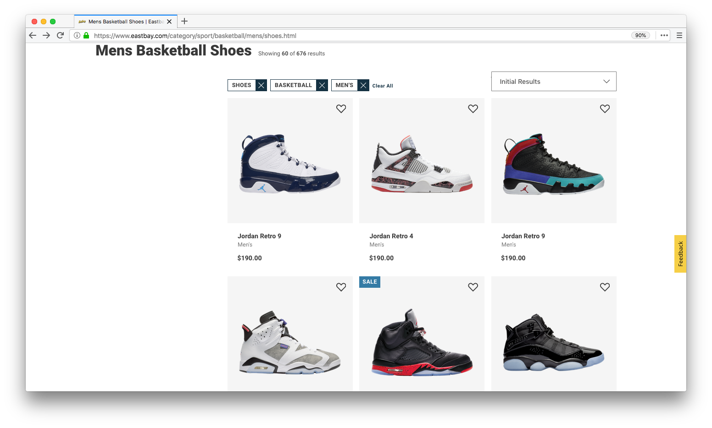
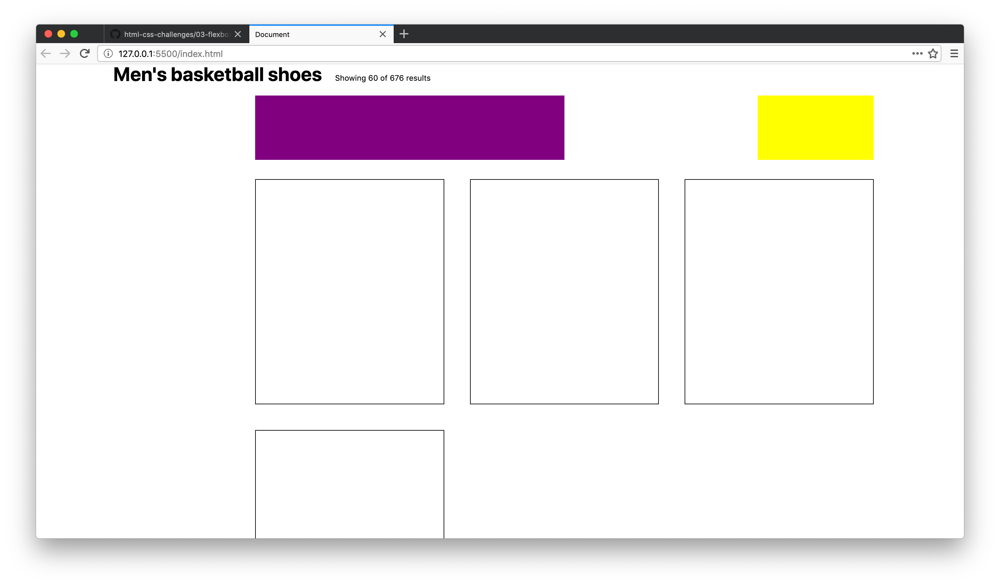
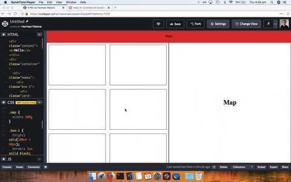

# CHALLENGES CSS FLEXBOX 01

## Project description

CSS Challenges by Coder Academy MEL.

Link: https://github.com/CoderAcademy-MEL/html-css-challenges/blob/master/03-flexbox.md

### Challenge 01

Create a centred box (500px by 500px) in the middle of a full width page using flexbox.

### Challenge 02

Create a row of 4 boxes (200px by 200px) using flexbox.

Test out some different ways to align the boxes on the horizontal axis using justify-content.

### Challenge 03

Build a similar navbar to the image below with flexbox. Add it to your component library you started yesterday.

### Challenge 04

Not resolved by needing subscription to the website shown below.

https://edstem.org/courses/4230/challenges/10881

### Challenge 05

Build a similar card based layout using the video below as a reference.

https://youtu.be/QGHpc95EZNQ

Think about what you'll need to attack this problem.

1. A container flexbox
2. Children inside of the flexbox
3. Media queries for the different sizes of the children based on screen sizes
4. A background image inside of the child
5. Content that sits just below the background image
6. Using margin to ensure that the edge of your children have the same vertical position as your header

### Challenge 06

Complete the flexbox froggy game: https://flexboxfroggy.com/

### Challenge 07

Create a page with a navbar (with a height of 60px) and a container (with a height of 100vh) underneath the navbar.

You'll need to look up CSS calc for an elegant solution in making sure the page doesn't scroll at all.

Once you solve that implement a similar box-shadow on the navbar, style the links and ensure that the message in the container is perfectly centered on the page using flexbox.

### Challenge 08

Create a similar form to the image below (with a username, password and submit button) using flexbox.

Think about what you'll use for your flex-direction. Centre the form in the middle of the page.

### Challenge 09

Read through chapters 7 to 9 of the interneting is hard documentation.

link: https://www.internetingishard.com/

### Challenge 10

The image below of eastbay.com is the goal layout.

This is a tricky task that will require a lot of flexbox. Start simple. Think about the individual components the layout might be using.

The top navbar with text could be its own flexbox. The filter section could be its own flexbox. The cards could also be their own flexbox exploding_head.

The card section is a tough one. Think about making your flex children have the width and your inner card can take the height and margin.

Here is the result of some code I wrote that demonstrates a bare bones setup for the goal layout. Let me know if you have questions.

### Challenge 11

Create this layout with flexbox.

In the map section add a Google Map using the Google Maps API.

### Challenge 12

This challenge ties everything we've done in CSS together. It's practice for your portfolio assignments.

Firstly, go to this link: http://www.csszengarden.com/ and download the template HTML and CSS files.

Your goal is to style the provided markup art. So no editing of the HTML! You can only write CSS.

If you're proud of your work I'd love for you to demo it to the class on Tuesday next week!

### Challenge 13

Watch all of Wes Bos's flexbox tutorials.
link: https://flexbox.io/
Status: Unfinished

### Challenge 14

Complete all of the freecodecamp flexbox challenges.
link: https://www.freecodecamp.org/learn/responsive-web-design/css-flexbox/

### Challenge 15 (extra bonus)

Extra Bonus: Complete all of the freecodecamp Grid challenges.
link: https://www.freecodecamp.org/learn/responsive-web-design/css-grid/create-your-first-css-grid

---

## Used technology

- Html 5
- CSS

## Resources and documentation used

- Git Hub: https://github.com/CoderAcademy-MEL/html-css-challenges/blob/master/03-flexbox.md

## Developers: Requirements

- Web Browser
- Code editor

## Developers: Installtion

1. Clone the repository: https://github.com/newmanferrer/challenge-191022-css-flexbox-01.git
2. Another option is to download the repository using ZIP format.

---

## Author: Newman Ferrer

newmanferrer@gmail.com

:sun_with_face: Maracaibo - Venezuela :venezuela:

Challenge date: 19/10/2022
